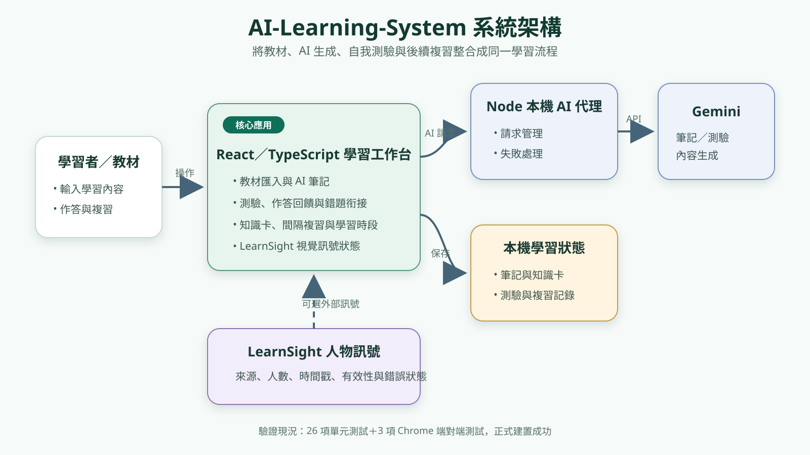

# AI Learning System：推甄作品說明

## 30 秒摘要

本作品是一套可操作的學習研究原型：使用者匯入教材或筆記，系統整理學習內容、產生測驗、安排 FSRS-style 間隔複習，並可將 YOLO 人物訊號連接到讀書時段。重點不是堆疊 AI 名詞，而是把輸入、生成、作答、複習、視覺訊號與可回顧紀錄串成完整流程。

## 我解決的問題

學習工具常把筆記、測驗與複習拆成不同服務，也容易把「鏡頭看到人」誤說成「學生專心」。我將流程整合，並明確保留證據界線：LearnSight 只接收人物存在的聚合訊號，不辨識身分、動作或專注度；離線示範資料只驗證流程，不冒充 AI 生成品質。

## 完成的系統能力

| 模組 | 已完成 | 可核對證據 |
| --- | --- | --- |
| 教材與筆記 | PDF／TXT 匯入、筆記與摘要流程、輸入限制與錯誤提示 | `src/routes/`、PDF 端到端測試 |
| 測驗與複習 | 題目結構驗證、答題回饋、FSRS-style 排程 | 單元測試與瀏覽器流程 |
| AI 安全邊界 | Gemini 由本機後端代理，限制輸入、來源、頻率與逾時 | `server/`、`.env.example` |
| LearnSight | 登入、開始、同步、結束、保存與匯出時段 | `src/routes/LearnSight.tsx`、整合紀錄 |
| 真實視覺串接 | 本機影片，以及本人前置鏡頭 `1 → 0 → 1` 實測 | `docs/yolo-integration.md` |

## 個人貢獻與 AI 協作界線

本專題由林琨茂個人發想、規劃與製作。我負責需求拆解、系統整合、流程取捨、測試設計、實測與結果說明。開發過程大量使用 AI 協助程式草稿、除錯與文件整理；我負責核對產出、修正不一致、執行測試並對最後結果負責。本作品不宣稱所有程式碼均逐行手寫，也不把第三方 Gemini、YOLO 或 FSRS 概念視為自創模型。

## 一個真實的除錯歷程

前置鏡頭視窗曾能成功框出人物，但 LearnSight 顯示「找不到指定的偵測來源」；同時網站服務也曾因 8000 埠已被另一個程序占用而無法重啟。我將問題拆成鏡頭輸入、模型推論、聚合狀態、`source_id`、時間戳有效性、API 與前端六層逐一核對，修正來源代號與程序啟動方式，最後完成入鏡、離開、返回的 `1 → 0 → 1` 實測。這段經驗讓我理解：畫面能辨識不等於系統已整合，真正可用的作品必須驗證跨模組資料流與錯誤狀態。

## 驗證矩陣（2026-09-30）

| 驗證 | 結果 | 能證明 | 不能證明 |
| --- | ---: | --- | --- |
| Vitest 單元測試 | 26 項通過 | 狀態、資料結構與核心邏輯 | 真實 AI 品質 |
| Chrome 端到端 | 3 條通過 | 關鍵使用流程與保存 | 所有裝置相容性 |
| TypeScript + Vite 正式建置 | 通過 | 型別與發布建置可完成 | 生產部署安全性 |
| 前置鏡頭整合 | `1 → 0 → 1` 完成 | 鏡頭到 LearnSight 的資料流 | 動作／專注分類準確率 |

## 教授三分鐘展示路線

1. 用架構圖說明教材、學習活動、複習與視覺訊號的關係。
2. 載入離線示範教材，依序展示筆記、測驗與下一次複習時間。
3. 開啟 LearnSight 的真實整合圖片或影片，指出來源、時間戳與有效／無效狀態。
4. 展示測試結果，清楚說明 mock、真實實測與尚未研究驗證的差別。

## 下一步研究

下一步不是再增加頁面，而是以可標註的學習情境資料，評估不同光線、遮擋與多人情境的人物訊號可靠性；再設計受試者研究，檢驗複習安排或提醒是否真的改善學習成果。在完成研究前，不把人物存在解讀為專注或理解。
