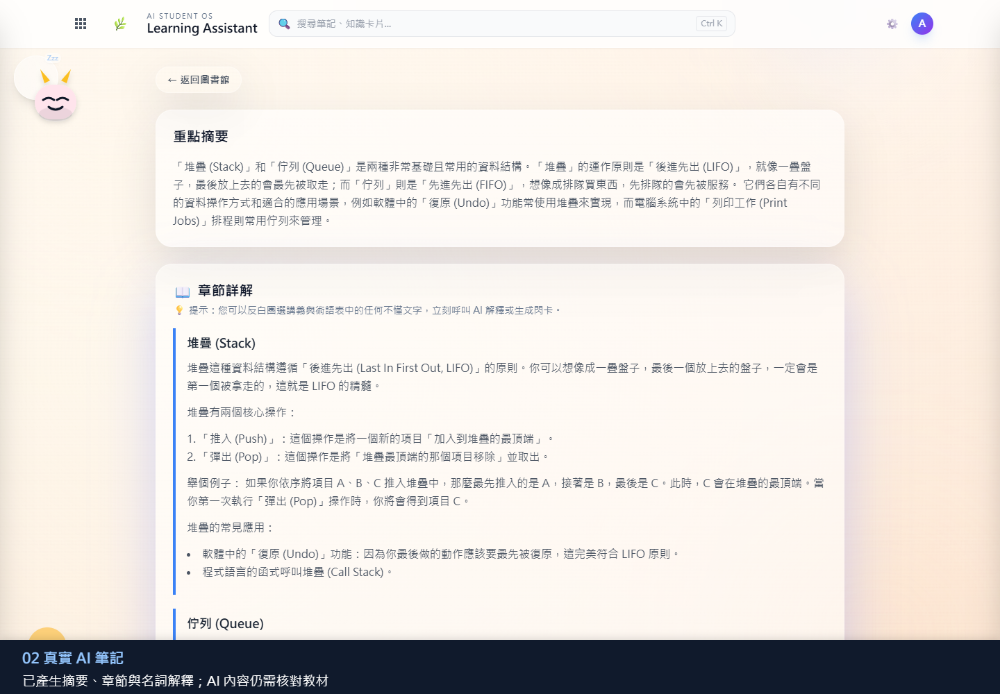
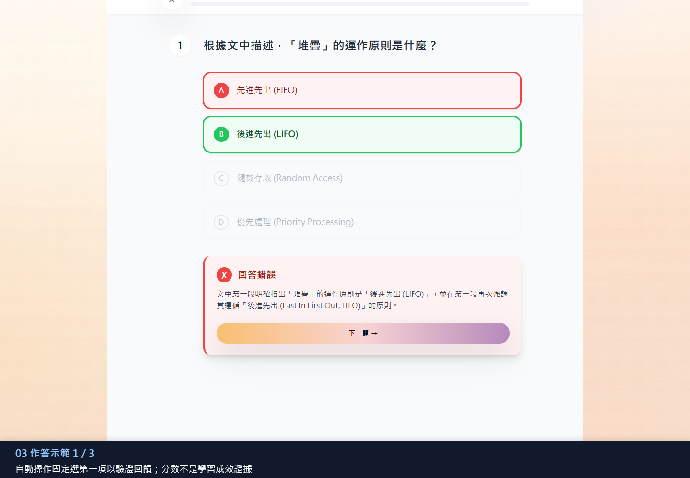

# AI 學習系統：初學者圖文操作指南

這是一套把「讀教材 → 整理重點 → 作答 → 安排複習」接起來的學習系統原型。你不需要先懂機器學習；先走完離線示範，再設定自己的 Gemini 金鑰與選用的 YOLO 服務。

本頁使用先前保存的實際介面截圖，2026-09-11 補充圖說；不是本次重新執行 AI 生成或攝影機測試的紀錄。

## 1. 第一次啟動：先不使用 API 金鑰

先安裝 Node.js 22.12 以上與 Git，開啟終端機：

```powershell
git clone https://github.com/professor03/AI-Learning-System.git
cd AI-Learning-System
Copy-Item .env.example .env
npm ci
npm run dev
```

已有 `.env` 時不要覆蓋它；這裡複製的是第一次使用的設定範本。`npm ci` 安裝專案套件，`npm run dev` 啟動前端與本機 AI 後端。保持終端機開啟，瀏覽 `http://127.0.0.1:5173`；若啟動失敗，先查看終端機錯誤，不要只反覆重新整理網頁。

首頁按「載入離線示範教材」。教材、三題測驗與四張複習卡是預先編寫的；可以體驗流程，但不能把它們當成 AI 即時生成成果。

## 2. 筆記：從一份教材變成有層次的內容



這張既有示範圖使用堆疊（Stack）與佇列（Queue）教材。

| 畫面位置 | 看什麼 | 你可以如何驗證 |
| --- | --- | --- |
| 重點摘要 | 用較短篇幅整理教材重點 | 對照原文，確認沒有把 LIFO 與 FIFO 寫反 |
| 章節詳解 | 按主題解釋概念、操作與例子 | 檢查範例是否真的符合該資料結構 |
| 教材導覽 | 返回教材清單，再選擇不同內容 | 確認目前閱讀的是自己選取的教材 |

要用自己的教材，可匯入支援的 PDF／TXT 或輸入筆記。需要 AI 生成時，依 [README](../README.md#環境變數與安全提醒) 在本機 `.env` 設定 `GEMINI_API_KEY` 並重新啟動；金鑰交由本機後端使用，不要放進 `VITE_` 變數或上傳 GitHub。

掃描成圖片的 PDF 目前不支援 OCR；能打開 PDF 不代表一定能抽取文字。AI 內容仍須核對教材，並非可靠性已經過研究驗證的自動教科書。

## 3. 測驗：不只算分，也呈現為什麼答錯



這張圖刻意選了錯誤答案，驗證回饋是否出現；不是使用者學習成績的研究數據。

1. 從測驗入口選擇示範題或教材對應題目。
2. 閱讀問題並選擇答案。
3. 檢查選項顏色與文字：圖中 A「先進先出」是錯誤選擇，B「後進先出」才符合堆疊。
4. 閱讀下方解釋，再按「下一題」。
5. 完成題組，回到教材查看自己不熟悉的概念。

## 4. 間隔複習：安排下一次回想

到間隔複習頁開啟卡片，先嘗試自行回想，再看答案並依實際記憶情況回報，觀察下一次複習時間更新。這裡使用 FSRS-style 排程；意思是依答題／記憶回饋安排時間，不能直接宣稱已證明比其他排程有效。

本頁目前未附複習頁的獨立截圖；不要把上方測驗照片當作複習排程的畫面證據。

## 5. LearnSight：選用的外部人物訊號


| 圖片區塊 | 使用方式 | 重要提醒 |
| --- | --- | --- |
| YOLO 服務網址與帳號 | 填入自己啟動的 YOLO 服務位址並登入 | 圖中 `8001` 是那次展示設定；目前 YOLO 公開 demo 預設為 `8000`，帳號也須自行建立 |
| 讀書時段 | 填入目標和預計時間，開始工作階段 | 預計 25 分鐘不代表實際已讀書 25 分鐘 |
| 視覺訊號狀態 | 同步服務提供的人物數摘要 | 有人不代表專注，也不是動作分類 |
| 結束時段 | 結束後回顧保存的摘要 | 歷史留在目前瀏覽器，最多 200 筆；不是雲端帳號資料庫 |

YOLO 是另外一個服務，不會只因為 AI 學習系統開啟就自動可用。先依 [YOLO 圖文指南](https://github.com/professor03/yolo-/blob/main/docs/visual-guide.md) 啟動服務與本機影片偵測，再回來連線。**沒有攝影機也可以用有權使用的本機影片**。本頁截圖展示的是既有整合狀態，不是新拍攝的前置鏡頭結果。

開始時段後，先同步再結束；重新整理頁面會清除登入憑證，請先結束時段。手動模擬訊號與真實人物偵測要分開說明。LearnSight 只接收人物聚合資訊，不因此代表 YOLO 偵測端完全不產生本機影像檔案。

## 6. 常見卡住的地方

| 狀況 | 先檢查什麼 |
| --- | --- |
| 網頁打不開 | 終端機是否仍執行、套件安裝是否成功、網址是否為該模式的連接埠 |
| 沒有金鑰 | 先用首頁離線示範；它不是線上 AI 生成 |
| AI 產生失敗 | 檢查 `.env`、本機後端、網路及供應商回應；不要公開錯誤中的金鑰 |
| PDF 沒有內容 | 確認是否為可選取文字的 PDF；掃描 PDF 的 OCR 尚未支援 |
| LearnSight 連不上 | YOLO 是否另行啟動、網址與帳號是否正確；不是填入 GitHub 網址 |
| 換瀏覽器找不到歷史 | 記錄是本機瀏覽器保存，沒有跨裝置雲端同步 |

正式建置展示可用 `npm run build` 後 `npm start`，網址為 `http://127.0.0.1:8787`，與開發模式 5173 不同。更完整的設定、測試指令與已知限制見 [README](../README.md)。

## 7. 此專題呈現的實作能力

你可以展示教材輸入、前後端 API 串接、結構化內容呈現、測驗互動、複習排程、外部服務整合與本機紀錄。這些是「做過什麼系統、能解釋哪些流程」的具體證據；畫面本身不是學習成效提升的證明。

本專題由林琨茂個人發想與製作，大量使用 AI 協助程式產生、修改與文件整理。需要如實區分個人需求規劃與整合、AI 協作、第三方模型，以及尚待研究驗證的部分。

