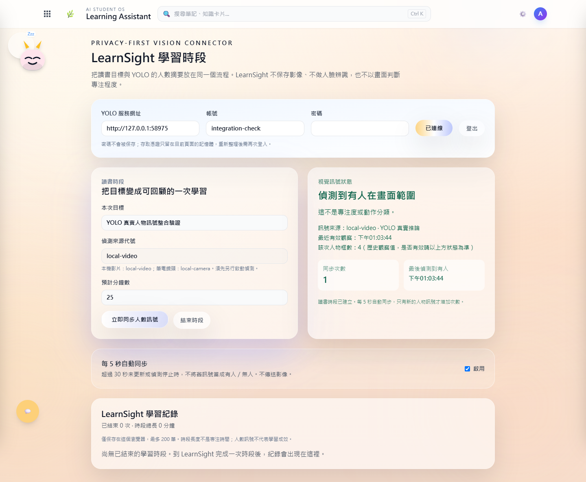
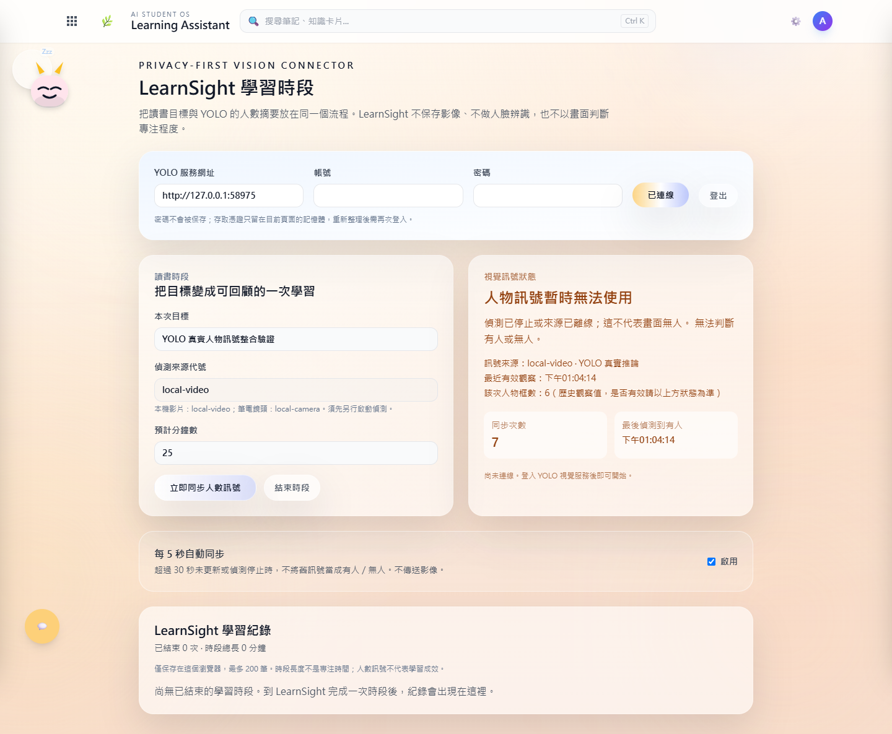

# YOLO × AI 學習系統：真實人物訊號整合

2026-09-12 已完成本機影片的跨專案聯測。不是把 YOLO 圖片貼進學習系統，而是把實際偵測產生的數值送進學習時段。

## 實際連接了什麼？

本機影片 → YOLOv8n／ByteTrack → 共用人物摘要 → FastAPI 登入與 LearnSight API → AI 學習系統 → 已結束時段紀錄。

- 每 5 秒嘗試同步一次；切去筆記等頁面仍持續同步。瀏覽器休眠／背景節流可能延遲，不是硬即時保證。
- 顯示指定來源、最近有效觀察時間、人物框數，區分真實推論與手動模擬。
- 重複讀取同一時間戳不增加同步次數；不同來源不混合計數。
- 超過 30 秒未更新、來源離線、資料格式錯誤：顯示不可用，不當成零人；離席累計會在訊號中斷時重設。
- 結束後把摘要保存在目前瀏覽器；重新整理仍能在儀表板回顧，不保存密碼或登入憑證。

## 這次的真實成果



這次使用既有 `sample.avi`，不是作者自攝影片。圖中出現 4 個人物框的訊號，是當次實際模型推論經 API 傳到前端的數值，不是固定的測試回應。圖中連接埠是自動測試隨機分配的；一般使用請按下方預設網址設定，不要照抄測試帳號或埠號。



停止偵測後仍保留「最近有效觀察」供追查，但上方狀態明確顯示不能判斷現在有人或無人。這能避免把舊影格的數字當作目前狀態。

這次學習時段約 46 秒，接收 7 次不同時間戳的有效人物訊號；不是 25 分鐘學習實驗，也不是 7 人出席。25 是預計分鐘數。完整檢查結果見 [verification.json](assets/integration/verification.json)。

| 驗證 | 本機結果 |
| --- | --- |
| 尚未啟動偵測 | 顯示不可用，不視為零人 |
| 真實模型 → 資料檔 → API → React | 通過，沒有攔截或替換 API 回應 |
| 切到筆記頁 | 仍收到新的真實人物訊號 |
| 停止偵測 | 顯示來源離線，未誤記為離席 |
| 結束 → 儀表板 → 重新整理 | 摘要仍存在，來源標記為 detector |
| 本機儲存檢查 | 未寫入密碼或 token |

## 第一次啟動：三個終端機

兩個倉庫都要更新到包含這次整合的版本。先分別依各自 README 完成 Python 與 Node.js 依賴安裝。這是兩個服務的整合，不是把 Python 模型塞進前端網站。

### 終端機 A：YOLO API

在 YOLO 倉庫根目錄啟用 Python 虛擬環境，再執行：

```powershell
python scripts/serve_demo.py
```

首次啟動自行建立帳號密碼；已有帳號不要刪除資料庫。服務預設 `http://127.0.0.1:8000`。

### 終端機 B：選擇一種影像輸入

同樣在 YOLO 倉庫、同一套虛擬環境執行。先建議使用自己有權處理的影片：

```powershell
python scripts/detect_demo.py "C:\path\to\your-video.mp4" --duration 180 --show
```

若要用自己的筆電鏡頭，改成下面這個命令，**不要同時啟動兩個輸入**：

```powershell
python scripts/detect_camera.py --camera-index 0 --duration 180 --show
```

鏡頭索引 0 不保證一定是前置鏡頭；找不到時需確認 Windows 權限、其他程式是否占用，以及鏡頭索引。選用 `--fallback-camera-index 0` 可在首選鏡頭不能開啟時嘗試指定備援。這次自動測試沒有開啟任何鏡頭，硬體現場驗證仍待完成。

首次使用模型可能下載權重；已有權重時，影片命令可加 `--weights "C:\path\to\yolov8n.pt"`。影像在本機處理，但 YOLO 偵測端仍會產生本機最新標記 JPEG 與實驗輸出；LearnSight 不傳送或保存原始影像。不應因此宣稱整個 YOLO 專案完全不落地影像。

### 終端機 C：AI 學習系統

在 AI-Learning-System 根目錄：

```powershell
npm run build
npm start
```

開啟 `http://127.0.0.1:8787/learnsight`。這段人物訊號整合不需要 Gemini 金鑰。

1. YOLO 網址填 `http://127.0.0.1:8000`，用終端機 A 建立的帳號登入。
2. 填讀書目標與預計分鐘數。
3. 影片來源代號填 `local-video`；鏡頭來源代號填 `local-camera`。
4. 開始時段，觀察最近時間與人物框數更新。
5. 可透過應用程式選單切去 Notes，回來仍是同一個時段。
6. 結束時段，再到儀表板查看／匯出紀錄。

`serve_demo.py` 與偵測端預設共用 `data/public-demo.db`、`data/public-demo.json`。若自訂 `DATABASE_URL` 或 `DATASTORE_PATH`，兩個 YOLO 終端機必須一致。自訂前端埠號時也要設定 YOLO 的 `CORS_ORIGINS`；預設已允許 5173 與 8787 的 localhost／127.0.0.1。

## 可重跑的驗證

在 AI 學習系統根目錄執行，所有參數換成自己的實際路徑：

```powershell
node scripts/verify-yolo-integration.mjs --yolo "C:\path\to\yolo-" --python "C:\path\to\yolo-\.venv\Scripts\python.exe" --video "C:\path\to\your-video.mp4" --weights "C:\path\to\yolov8n.pt"
```

測試使用 Chrome（已安裝時），也可用 `PLAYWRIGHT_CHANNEL` 指定可用通道；會建立獨立的測試帳號／資料庫，不改原有使用者紀錄，不開啟攝影機。結果在 `integration-results/`，預設只截圖、不錄影；錄影需另設 `INTEGRATION_RECORD_VIDEO=1` 且 ffmpeg 可執行。本次成功紀錄是截圖與 JSON，沒有新的連續影片。

## 邊界與備審表述

這次證明的是資料流程與錯誤處理。沒有證明學生動作分類、專注度、理解程度或學習提升。自己的鏡頭／影片、實際入鏡離開返回、不同光線與遮擋，仍需要由作者配合完成現場驗證。

目前適合單人本機展示：後端時段仍存在單一進程記憶體，重啟會清除；前端重新整理會清除憑證，請先結束時段。沒有多使用者時段存取隔離或雲端歷史同步，不應直接公開部署。較重的 `/health` 診斷端點在本環境未能及時回應；啟動確認使用 `/healthz`，不把診斷問題誤報為整個服務離線。

可以如實介紹：「我把第三方人物偵測模型接到自己的 AI 學習系統，設計來源與時效檢查、跨頁同步及時段紀錄，並驗證正常與中斷流程。」個人發想與製作、大量 AI 協作、第三方模型和待驗證項目都應分開說明。

